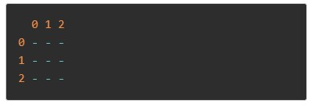

# Instructions Part 1

  Create a TicTacToe class that initializes a 3x3 board of "-" values. We will use this class in future exercises to fully build out a Tic Tac Toe game!

The TicTacToe class should have a 2D array as an instance variable and a constructor that initializes the 2D array with the "-" value.

Add a getter method that returns the private 2D instance variable.

# Instructions Part 2

For this exercise, you will complete the TicTacToe Board that we started in the 2D Arrays Lesson.

We will add a couple of methods to the TicTacToe class.

To track whose turn it is, we will use a counter turn. This is already declared as a private instance variable.

Create a getTurn method that returns the value of turn.

Other methods to implement:

printBoard()- This method should print the TicTacToe array onto the console. The board should include numbers that can help the user figure out which row and which column they are viewing at any given time. Sample output for this would be:

pickLocation(int row, int col)- This method returns a boolean value that determines if the spot a user picks to put their piece is valid. A valid space is one where the row and column are within the size of the board, and there are no X or O values currently present.

takeTurn(int row, int col)- This method adds an X or O to the array at position row,col depending on whose turn it is. If it’s an even turn, X should be added to the array, if it’s odd, O should be added. It also adds one to the value of turn.

checkWin()- This method returns a boolean that determines if a user has won the game. This method uses three methods to make that check:

checkCol- This checks if a player has three X or O values in a single column, and returns true if that’s the case.

checkRow - This checks if a player has three X or O values in a single row.

checkDiag - This checks if a player has three X or O values diagonally.

checkWin() only returns true if one of these three checks is true.

# Instructions Part 3

In this exercise, we are going to complete the Tic Tac Toe game. In the TicTacToeTester class, use the methods that you created in the TicTacToe class to implement your own version of Tic Tac Toe.

Your game should take user input to determine which index the user would like to place their X’s and O’s, and check to see if there is a winner after every turn that is taken. If the user inputs an invalid space, they should be notified, and asked to input another index. Utilize loops to implement this effectively!

Your game should indicate which player won, and notify the users if there is a tie at the end.

Take advantage of all the methods that you created in the previous exercise, and feel free to make alterations to the game to make it your own!